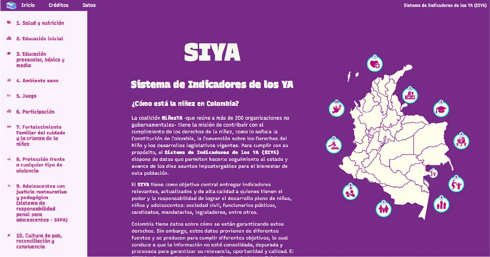

# Aplicaciones para tablero de Niñez YA


El **SIYA (Sistema de Indicadores de los YA)** tiene como objetivo central entregar indicadores relevantes, actualizados y de alta calidad a quienes tienen el poder y la responsabilidad de lograr el desarrollo pleno de niñas, niños y adolescentes: sociedad civil, funcionarios públicos, candidatos, mandatarios, legisladores, entre otros.



## Aplicaciones

Este repositorio contiene dos aplicaciones que componen el proyecto:

- **Procesador**: Transforma y procesa las fuentes de datos `.xlsx` y exporta archivos `.json` para ser utilizados en el tablero.
- **www**: El sitio del tablero.

## Apropiación o desarrollo

### Instalación

En su computador debe tener instalado:

- [NodeJS](https://nodejs.org/en/download 'Instrucciones para descargar NodeJS')
- [Yarn](https://classic.yarnpkg.com/lang/en/docs/install/#debian-stable 'Instrucciones para instalar Yarn')

Primero instalar las dependencias con:

```bash
yarn
```

### Iniciar tablero en servidor local

```bash
yarn dev
```
